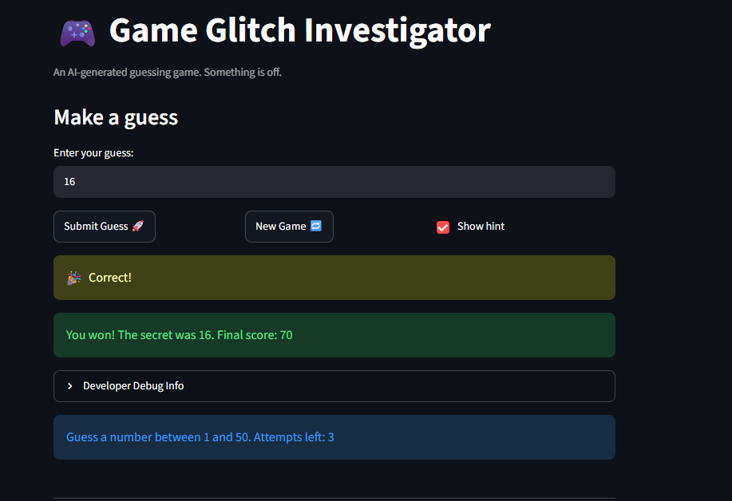

# 🎮 Game Glitch Investigator: The Impossible Guesser

## 🚨 The Situation

You asked an AI to build a simple "Number Guessing Game" using Streamlit.
It wrote the code, ran away, and now the game is unplayable. 

- You can't win.
- The hints lie to you.
- The secret number seems to have commitment issues.

## 🛠️ Setup

1. Install dependencies: `pip install -r requirements.txt`
2. Run the broken app: `python -m streamlit run app.py`

## 🕵️‍♂️ Your Mission

1. **Play the game.** Open the "Developer Debug Info" tab in the app to see the secret number. Try to win.
2. **Find the State Bug.** Why does the secret number change every time you click "Submit"? Ask ChatGPT: *"How do I keep a variable from resetting in Streamlit when I click a button?"*
3. **Fix the Logic.** The hints ("Higher/Lower") are wrong. Fix them.
4. **Refactor & Test.** - Move the logic into `logic_utils.py`.
   - Run `pytest` in your terminal.
   - Keep fixing until all tests pass!

## 📝 Document Your Experience

- [x] Describe the game's purpose.
- [x] Detail which bugs you found.
- [x] Explain what fixes you applied.

The purpose of my game is to create an interactive number guessing game where the player tries to guess a randomly chosen secret number wwithin a specific range. The game gives feedback after each guess by telling the user whether their guess is too high, too low, or correct. It also treacks the player's score and updates the game state as the user continues playing. This project helped me practice separating game logic from the user interface, writing automated tests, and using AI as a coding assistant to debug and improve my work

One bug I found was that the guess history section was not always current because the app displayed the history before the newest guess had been fully added to the session state. Another issue was that certain inputs, such as decimals, negative numbers, very large values, or blank spaces, could cause the game to behave incorrectly if they were not handled carefully. I also had to check that guesses outside the selected difficulty range did not break the game or create confusing feedback. During testing, I found that some logic needed to be moved into reusable helper functions so it could be tested more clearly with pytest.

To fix the history issue, I updated the order of the session state logic so that each new guess is saved before the history is displayed. I also improved the input parsing so the game handles invalid guesses more gracefully instead of crashing or giving unclear results. I added more pytest cases to check edge cases like negative numbers, decimals, extremely large values, and guesses outside the allowed range. Finally, I organized the core logic into logic_utils.py, which made the code easier to test, debug, and maintain separately from the Streamlit interface.

## 📸 Demo Walkthrough

Describe your fixed game in numbered steps so a reader can follow along without watching a video:

1. User opens the game and selects Normal difficulty.
2. Game sets the range to 1 to 50 and allows 6 attempts.
3. Secret number for this sample walkthrough is 42.
4. User enters a guess of 25.
5. Game returns "Too Low" and displays "Go HIGHER!".
6. Score updates from 0 to -5 after the incorrect guess.
7. User enters a guess of 48.
8. Game returns "Too High" and displays "Go LOWER!".
9. Score updates from -5 to -10 after the second incorrect guess.
10. User enters a guess of 42.
11. Game returns "Correct!" and ends the game as a win.
12. Since the correct guess happened on attempt 3, the win bonus is 80 points.
13. Final score updates from -10 to 70.
14. Game displays the winning message with the secret number and final score.
15. User can click New Game to reset the secret number, attempts, score, status, and history.


**Screenshot** *(optional)*: <!-- Insert a screenshot of your fixed, winning game here -->



## 🧪 Test Results

```

# Paste your pytest output here
============================================================================ test session starts ============================================================================
platform win32 -- Python 3.13.0, pytest-9.0.3, pluggy-1.6.0
rootdir: C:\Users\tade4\OneDrive\Documents\GitHub\ai110-module1show-gameglitchinvestigator-starter-main
plugins: anyio-4.13.0
collected 47 items                                                                                                                                                           

tests\test_game_logic.py ...............................................                                                                                               [100%]

============================================================================ 47 passed in 0.07s =============================================================================
```

## 🚀 Stretch Features

- [ ] [If you choose to complete Challenge 4, describe the Enhanced UI changes here — a screenshot is optional]
